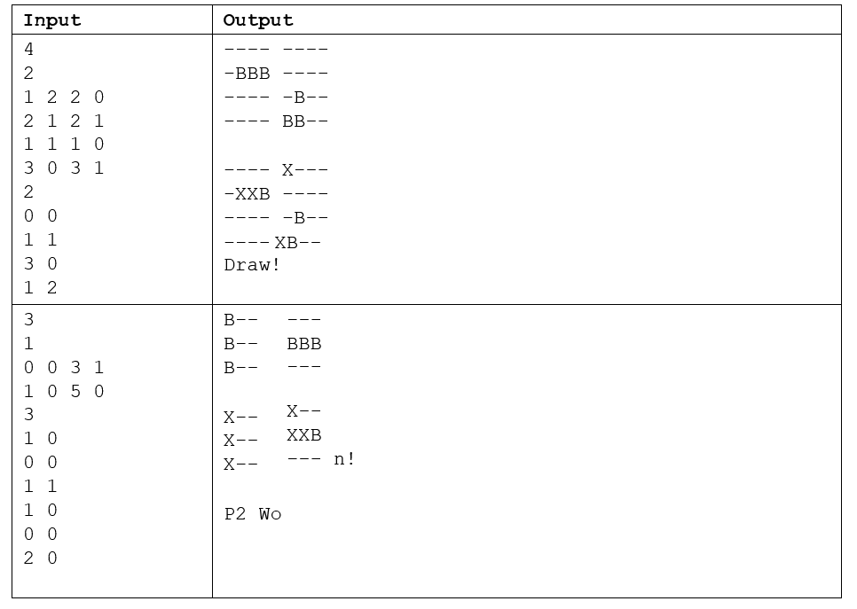

# BattleshipGame

**Description:**

Battleship is a classic two-player strategy guessing game that simulates naval combat. The game is typically played on a grid-based board where each player hides a fleet of warships. The objective is to discover and sink the opponent's fleet before they sink yours.

**Game Setup:**

- **Game Board:** The game is played on a grid, often 10x10, where each cell on the grid is identified by coordinates (e.g., A1, B2, C3).

- **Fleet Placement:** Each player secretly places their fleet of warships on their grid. The fleet consists of different types of ships, usually including a Carrier (5 squares), Battleship (4 squares), Cruiser (3 squares), Submarine (3 squares), and Destroyer (2 squares). Players can place their ships horizontally or vertically on the grid.

- **Hidden Fleet:** The locations of the ships are concealed from the opponent, and players take turns calling out coordinates to make "shots" at the opponent's grid, attempting to hit and sink their ships.

**Gameplay:**

- **Taking Shots:** Players take turns calling out coordinates (e.g., "B3," "E5") to target specific squares on the opponent's grid. The opponent responds with either "hit" or "miss." If a shot hits a square occupied by an opponent's ship, it's a "hit." If it hits an empty square, it's a "miss."

- **Sinking Ships:** When a shot results in a "hit," the player marks that square on their own grid as a "hit." When all squares of a ship have been hit, that ship is considered "sunk."

- **Turn-Based:** The game proceeds in a turn-based fashion with players taking alternate shots.

- **Winning:** The objective is to sink all of the opponent's ships before they sink yours. The first player to sink the entire enemy fleet wins the game.

**Game Strategy:**

- Players use deduction and strategy to locate and sink the opponent's ships efficiently. They can try to hit adjacent squares if they suspect a ship is in the area.

- Some variations of the game introduce special moves or abilities, adding complexity to the strategy.

**Variations:**

- Electronic versions of Battleship exist, including video games and mobile apps.

- Some versions feature alternative themes, such as space battleships or movie tie-ins.

**Skills Developed:**

- Logical deduction and strategy

- Spatial awareness

- Turn-based gameplay and decision-making

Battleship is a classic game known for its simple rules and challenging gameplay. It combines luck and skill as players attempt to outmaneuver and outguess their opponents, making it a timeless and enjoyable strategy game.

In this assignment, you will implement a 2-player game of Battleship. In case you don't know this game, you can find more information about it in the Wikipedia article here: https://en.wikipedia.org/wiki/Battleship_(game)  
You are going to represent the game board using 2D-Arrays, one 2D-array variable for each of the players. The arrays should be of type char or String. You can choose the data type you rather use. You must use 2D arrays or you will receive a zero. 
Board representation 
You should represent the board according to the example below (in this example the board is 5x5): 
 
 
 
Boat representation 
•	Boats will be presented by the letter 'B' on the player's board. When adding boats to their board, players will represent their boats’ position, size, and orientation using four numbers one after the other, separated by spaces:  
•	The first number represents the X coordinate of the boat 
•	The second number represents the Y coordinate of the boat 
•	The third number represents the boat's size, that is how many spaces in the board the ship will take. This number will be between 1 and 6 
•	The fourth number is the orientation of the boat: 
o 0 for horizontal: the ship will grow from its coordinate right o 1 for vertical: the ship will grow from its coordinate down 
 
 
 	 
Processing 
Your program will function as follows: 
1.	Read an integer number representing the board size (always square) 
2.	Initialize all the coordinates of the board with "-"  
3.	Read an int representing how many boats each player will add to their board 
4.	Add the ships for each player (one player after the other) following the boat representation above.  
a.	Example: 2 boats for each player 
b.	Player 1 boat 1 
c.	Player 2 boat 1 
d.	Player 1 boat 2 
e.	Player 2 boat 2 
5.	After adding the boats to the board, you will print both player's boards using the example below in the Examples section. 
6.	Then you will read a number representing how many shots will fire. 
7.	Read two integers representing x and y coordinates for the player's shot. Repeat this step, alternating the player's turn until you fired all the shots. If the shot coordinate is outside the board, ignore the shot. 
a.	Change the shots coordinate from either 'B' or '-' to 'X'  
8.	Print both player's boards again. 
9.	Print a String representing the final game state as follows: 
a.	Draw, that is, there are boats left in both player's boards 
b.	P1 Win: P2 has no more boats left, that is no more Bs on P2’s board). P1 still have boats 
c.	P2 Win: P1 has no more boats left, that is no more Bs on P1’s board. P2 still have boats 
d.	All destroyed: Both players have no boats left on their boards 
Input/Output Considerations: 
•	If a boat grows past the bounds of the 2D array, you should "shrink it" so it fits the play area. 
•	You must separate each player board using the tab scape character ('\t'). There is no spacing between each cell of the boards. 
o Codio will use strict whitespace. If you are not using \t between the boards your tests will not pass. 
•	You must add a new line between the two printing sequences. 
•	There should be a new line after printing the last board 
Required Methods 
The following methods are required in this assignment. If you fail to create and use the methods, you will not receive full marks. 
•	Create a method that receives the players boards and prints them to the console 
•	Create a method that receives both boards and determines who won. This method should not print to the console but rather return a value informing which player won (or draw or all destroyed). 
Examples
